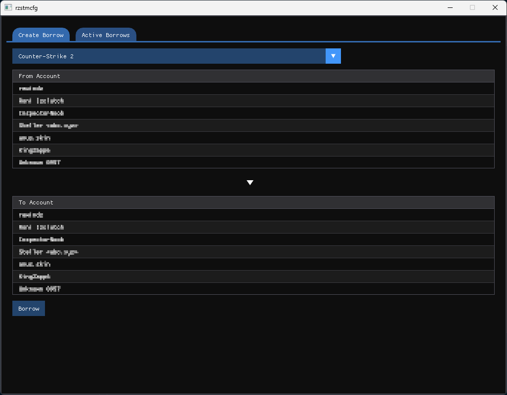

# rzstmcfg

**rzstmcfg** is a lightweight, cross-platform graphical utility that allows you to easily share Steam game configurations and local userdata between different Steam accounts on the same machine.



If you have multiple Steam accounts (e.g., a main account and an alt account) and want to use the exact same game settings (like your CS2 crosshair, binds, and video settings) without manually copying folders every time, or doing everything in an autoexec, this tool automates the process safely.

## Features

* **Account Detection:** Automatically locates your Steam installation (Windows & Linux) and detects all accounts that have logged in.
* **Profile Name Resolution:** Reads local `loginusers.vdf` and fetches account names directly from the Steam Community profile if they aren't cached locally.
* **Config Borrowing:** Temporarily transfers game configurations (from Steam's `userdata` folder) from one account to another. 
* **Safe Returns:** Keeps a safe backup of the original directories in a `borrows/` folder so you can easily "Return" a borrow and restore the original state.
* **Cross-Platform:** Supports both Windows and Linux.

## Supported Games
Currently configured games:
* **Counter-Strike 2** (AppID: 730)
* *(More games can be easily added by modifying the `GAME_IDS` map in `src/Games.hpp`)*

## Prerequisites

* A C++23 compiler
* [CMake](https://cmake.org/)
* OpenGL dev libraries

### Dependencies

* [Dear ImGui](https://github.com/ocornut/imgui) (GUI)
* [GLFW](https://github.com/glfw/glfw) (Windowing)
* [nlohmann/json](https://github.com/nlohmann/json) (JSON parsing/saving)
* [cpp-httplib](https://github.com/yhirose/cpp-httplib) & [mbedtls](https://github.com/Mbed-TLS/mbedtls) (HTTPS requests for Steam profile fetching)
* [ValveFileVDF](https://github.com/tyti/ValveFileVDF) (Included in `libs/` for parsing `.vdf` files)

## Building from Source

1. Clone the repository:
   ```bash
   git clone https://github.com/Rewindz/rzstmcfg
   cd rzstmcfg
   cmake -B build
   cmake --build build
